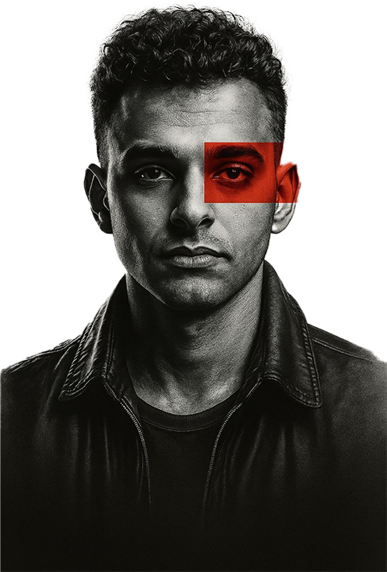

<h1 align="center">Beghdad Amine Portfolio</h1>

<p align="center">
Portfolio website for Beghdad Amine, Full Stack .NET Developer.
</p>

<p align="center">
  
</p>

## Structure

| Path | What it is |
| --- | --- |
| `index.html` | Page skeleton. All content is rendered from `data.json`. |
| `Assets/site.css`, `Assets/site.js` | Styles and behaviour (no framework, no build step). |
| `data.json` | Every piece of content. Each item holds **both** languages (`{ "en": "...", "ar": "..." }`), so English and Arabic cannot drift apart. |
| `wach-taaref/` | Sub-site for the Wach Ta3ref game (`index.html`, `privacy.html`, `game.css`, `game.js`). |
| `scripts/check-data.mjs` | Validates `data.json` (both languages present, images and links exist). |

## Working on it

```bash
python -m http.server 5173      # or: npx serve   (fetch() needs http, not file://)
node scripts/check-data.mjs     # run after editing data.json
```

- **Add a project:** append an object to `projects` in `data.json` (copy an existing one), drop its image in `Assets/`, run the check.
- **Language:** the site opens in the visitor's last choice, then their browser language. `?lang=ar` / `?lang=en` forces one.
- **Game goes live on Google Play:** set `PLAY_LIVE = true` at the top of `wach-taaref/game.js`.

## Design notes

Single accent colour (the red block from the portrait), one dark theme, Bricolage Grotesque + Geist + IBM Plex Sans Arabic, logical CSS properties so one stylesheet serves LTR and RTL, motion limited to `transform`/`opacity` and disabled under `prefers-reduced-motion`.
